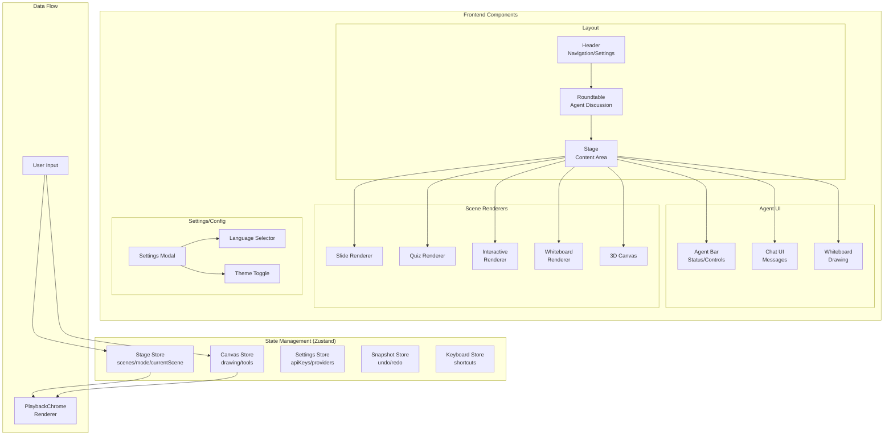
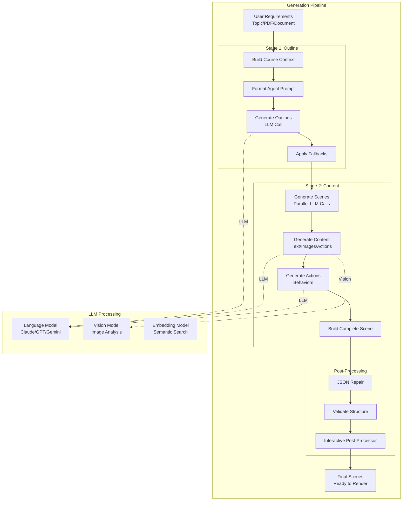
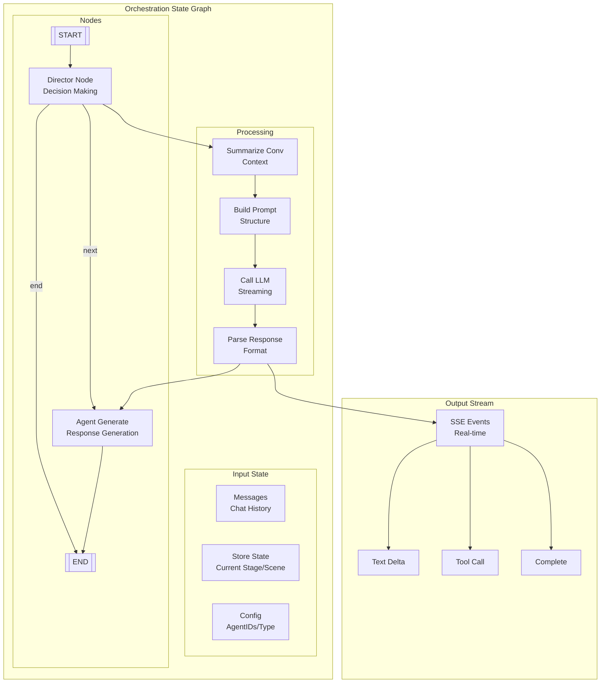
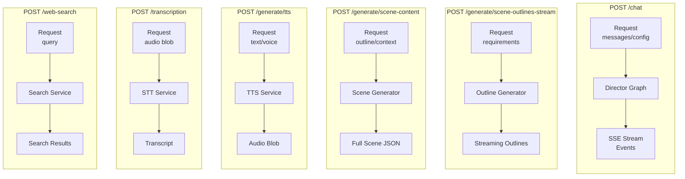
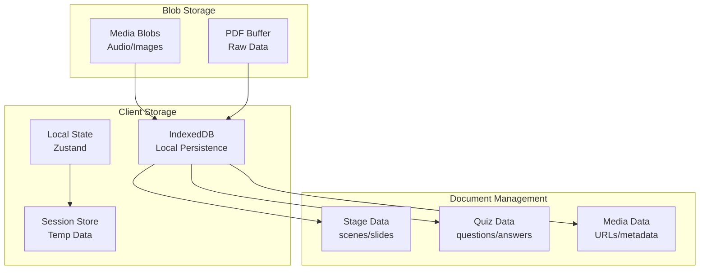
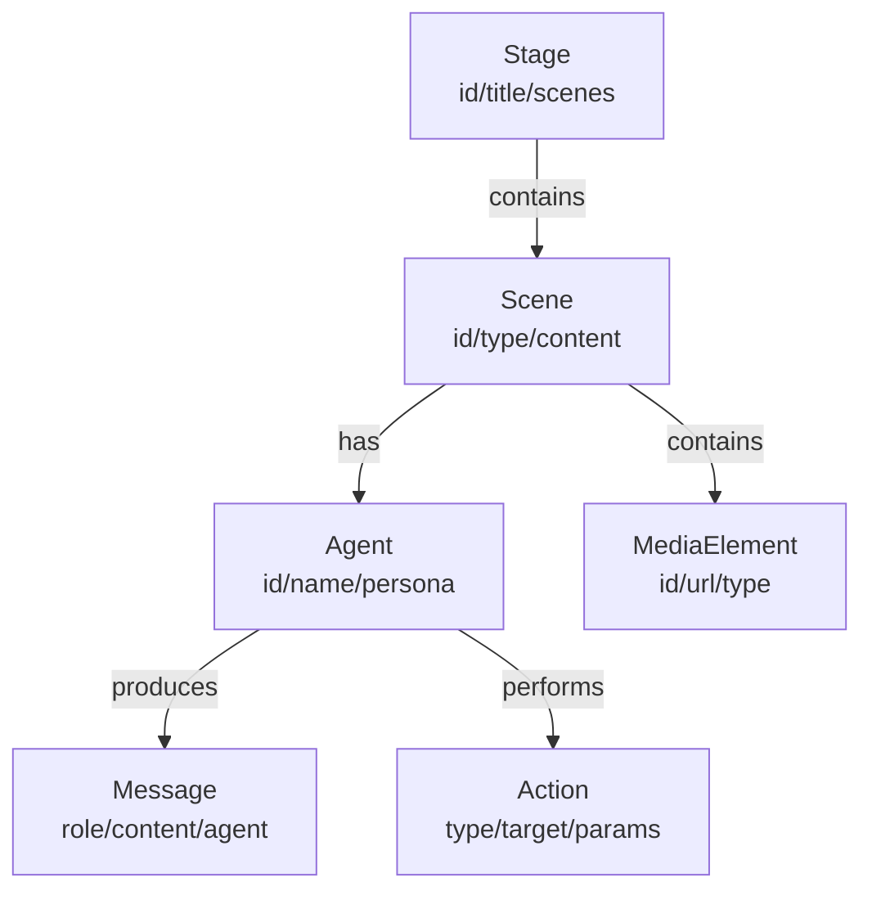

# OpenMAIC - System Architecture Diagram

## High-Level Architecture

```mermaid
graph TB
    subgraph "🎓 Frontend Layer"
        UI["UI Components<br/>React 19 + TypeScript"]
        Stage["Stage<br/>mode: edit/playback"]
        EditChrome["EditChrome<br/>Pro Mode Editor"]
        PlayChrome["PlayChrome<br/>Content Renderer"]
        Editor["Slide Editor<br/>Canvas/Whiteboard"]
    end

    subgraph "🔄 Client State Management"
        ZustandStore["Zustand Stores<br/>Stage/Canvas/Settings"]
        I18n["i18n<br/>Internationalization"]
        Theme["Theme Provider<br/>Dark/Light Mode"]
    end

    subgraph "🌐 API Layer"
        ChatAPI["POST /chat<br/>Multi-Agent Orchestration"]
        GenAPI["POST /generate/*<br/>Scene Generation"]
        AudioAPI["POST /generate/tts<br/>POST /transcription<br/>Audio Services"]
        MediaAPI["POST /proxy-media<br/>Content Delivery"]
        ValidationAPI["Verify APIs<br/>Model/Provider Check"]
        SearchAPI["POST /web-search<br/>Information Retrieval"]
    end

    subgraph "🤖 Orchestration Engine (LangGraph)"
        Director["Director Node<br/>Agent Selection"]
        AgentGen["Agent Generator<br/>Response Generation"]
        ToolRegistry["Tool Schema Registry<br/>Action Definition"]
        Conv["Conversation Summarizer<br/>Context Compression"]
    end

    subgraph "🎬 Generation Pipeline"
        OutlineGen["Outline Generator<br/>Scene Structure"]
        SceneGen["Scene Generator<br/>Content Creation"]
        SceneBuilder["Scene Builder<br/>Compose Elements"]
        ActionParser["Action Parser<br/>Behavior Logic"]
        PostProc["Post-Processor<br/>Refinement"]
    end

    subgraph "🎨 Scene Renderers"
        SlideRender["Slide Renderer<br/>PPTX/PDFs"]
        QuizRender["Quiz Renderer<br/>Assessment"]
        InteractiveRender["Interactive Renderer<br/>Simulations/Games"]
        PBLRender["PBL Renderer<br/>Project Tasks"]
        WhiteboardRender["Whiteboard Renderer<br/>Diagrams"]
    end

    subgraph "🔌 Provider Integrations"
        LLMProvider["LLM Provider<br/>OpenAI/Claude/Gemini"]
        TTSProvider["TTS Provider<br/>Azure/OpenAI/VoxCPM2"]
        STTProvider["STT Provider<br/>Transcription"]
        SearchProvider["Search Provider<br/>Web/MiniMax/Brave"]
        ImageProvider["Image Provider<br/>Vision Models"]
    end

    subgraph "💾 Data & Storage"
        DB["IndexedDB<br/>Local Store"]
        PDFParse["PDF Parser<br/>Content Extract"]
        DocStore["Document Store<br/>Persistence"]
        MediaStore["Media Store<br/>Audio/Video"]
    end

    subgraph "🛠️ Utilities & Infrastructure"
        Logger["Logger<br/>Debug Tracking"]
        Utils["Utils<br/>Helpers/Config"]
        Export["Export Handler<br/>PPTX/HTML"]
        Import["Import Handler<br/>MAIC DSL"]
    end

    UI --> Stage
    Stage -->|edit| EditChrome --> Editor
    Stage -->|playback| PlayChrome
    Editor --> ZustandStore
    PlayChrome --> ZustandStore
    ZustandStore --> Theme
    ZustandStore --> I18n

    PlayChrome -->|POST /chat| ChatAPI
    PlayChrome -->|POST /generate| GenAPI
    PlayChrome -->|audio| AudioAPI
    PlayChrome -->|media| MediaAPI

    ChatAPI --> Director
    Director -->|streaming| AgentGen
    AgentGen --> ToolRegistry
    GenAPI --> OutlineGen --> SceneGen --> SceneBuilder
    SceneGen --> ActionParser
    SceneBuilder --> PostProc

    Director --> Conv
    Conv --> LLMProvider

    OutlineGen --> LLMProvider
    SceneGen --> LLMProvider
    ActionParser --> LLMProvider

    SceneBuilder -->|render| SlideRender
    SceneBuilder -->|render| QuizRender
    SceneBuilder -->|render| InteractiveRender
    SceneBuilder -->|render| PBLRender
    SceneBuilder -->|render| WhiteboardRender

    PlayChrome --> SlideRender
    PlayChrome --> QuizRender
    PlayChrome --> InteractiveRender
    PlayChrome --> PBLRender
    PlayChrome --> WhiteboardRender

    AudioAPI --> TTSProvider
    AudioAPI --> STTProvider
    MediaAPI --> ImageProvider
    SearchAPI --> SearchProvider

    Export --> DB
    Import --> DB
    DB --> PDFParse
    DocStore --> MediaStore

    GenAPI --> Logger
    ChatAPI --> Logger
```

## Detailed Component Architecture

## Generation Pipeline Deep Dive

## Multi-Agent Orchestration (LangGraph)

## API Endpoints & Data Flow

## Storage Architecture

## Key Type Definitions

- **Scene**: Base unit of learning content (slide/quiz/interactive/PBL)
- **Stage**: Collection of scenes + metadata
- **Agent**: AI character with personality/actions
- **Action**: Behavioral instruction (speak/draw/gesture)
- **Message**: Chat item with role/content
- **SceneOutline**: Blueprint before full generation
- **GenerationContext**: Configuration for generation pipeline
- **StatelessEvent**: Streaming event type (textDelta/toolCall/complete)

## Technology Stack

| Layer | Technology |
|-------|-----------|
| **Frontend** | React 19, TypeScript 5, Next.js 16 |
| **State** | Zustand, Immer |
| **Styling** | Tailwind CSS 4, Motion |
| **Rendering** | Custom Canvas, Three.js, ProseMirror |
| **LLM** | LangGraph, AI SDK, LangChain |
| **Generation** | Custom Pipeline, JSON Repair |
| **Audio** | Web Audio API, TTS/STT Providers |
| **Export** | pptxgenjs, jszip |
| **Testing** | Vitest, Playwright |
| **Storage** | IndexedDB (Dexie) |
| **Internationalization** | i18next |
| **Icons** | Lucide React |

## Data Models

