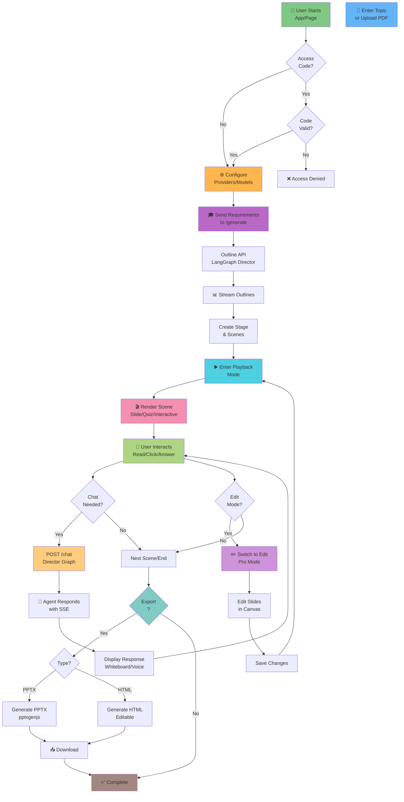
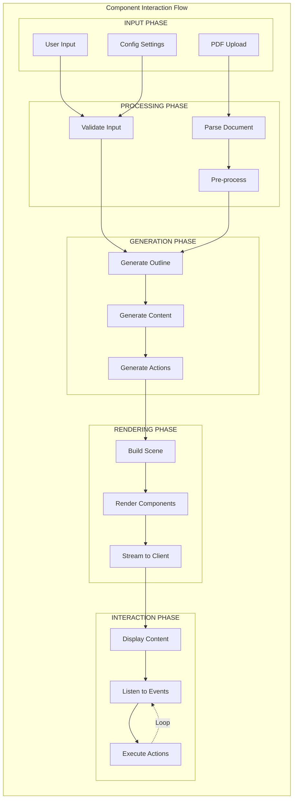
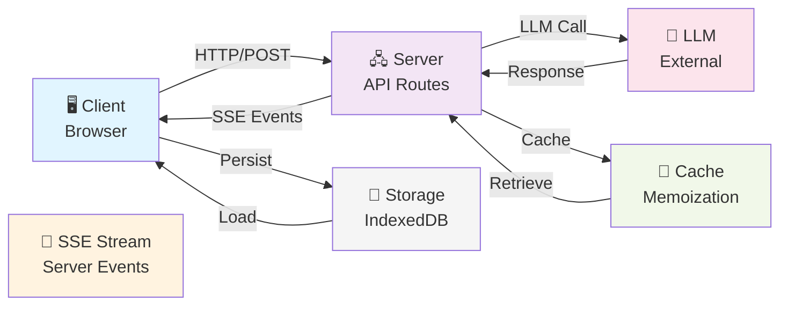
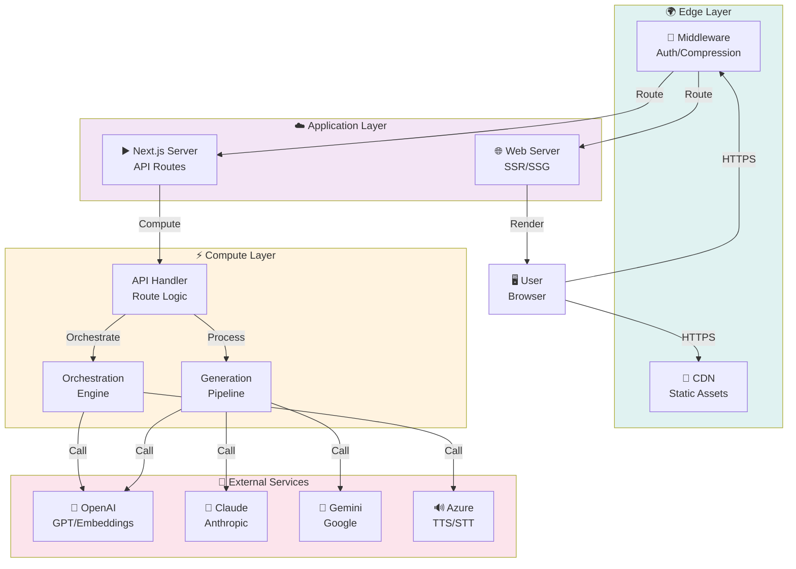

# OpenMAIC - Visual Architecture Diagram

## Complete System Architecture Diagram

```mermaid
graph TB
    %% Styling
    classDef frontend fill:#e1f5ff,stroke:#01579b,stroke-width:2px,color:#000
    classDef api fill:#f3e5f5,stroke:#4a148c,stroke-width:2px,color:#000
    classDef orchestration fill:#fff3e0,stroke:#e65100,stroke-width:2px,color:#000
    classDef generation fill:#f1f8e9,stroke:#33691e,stroke-width:2px,color:#000
    classDef rendering fill:#fce4ec,stroke:#880e4f,stroke-width:2px,color:#000
    classDef provider fill:#e0f2f1,stroke:#004d40,stroke-width:2px,color:#000
    classDef storage fill:#f5f5f5,stroke:#212121,stroke-width:2px,color:#000
    classDef utils fill:#ede7f6,stroke:#311b92,stroke-width:2px,color:#000

    %% Frontend Layer
    subgraph Frontend["🎓 FRONTEND LAYER"]
        UI["👥 UI Components<br/>React 19 + TypeScript"]
        Header["🎛️ Header<br/>Navigation/Controls"]
        Stage["🎬 Stage<br/>Mode Dispatcher"]
        EditChrome["✏️ Edit Chrome<br/>Pro Editor Mode"]
        PlayChrome["▶️ Play Chrome<br/>Playback Engine"]
        Roundtable["🔄 Roundtable<br/>Agent Discussion"]
    end

    subgraph State["🔄 CLIENT STATE LAYER"]
        ZustandStore["📦 Zustand Stores<br/>Stage/Canvas/Settings"]
        I18n["🌍 i18n Provider<br/>Multi-Language"]
        Theme["🎨 Theme Manager<br/>Dark/Light"]
        Context["🎯 Scene Context<br/>React Context"]
    end

    %% API Layer
    subgraph APILayer["🌐 API ENDPOINTS"]
        ChatAPI["💬 POST /chat<br/>Multi-Agent Chat"]
        GenAPI["🎓 POST /generate/*<br/>Scene Generation"]
        AudioAPI["🔊 Audio APIs<br/>TTS/Transcription"]
        MediaAPI["📦 Media Services<br/>Proxy/CDN"]
        ValidAPI["✓ Verification APIs<br/>Provider Check"]
        SearchAPI["🔍 POST /web-search<br/>Information"]
    end

    %% Orchestration
    subgraph Orchestration["🤖 ORCHESTRATION ENGINE"]
        Director["👨‍💼 Director Node<br/>Agent Selection"]
        AgentGen["🎙️ Agent Generator<br/>Response Generation"]
        ToolRegistry["🔧 Tool Registry<br/>Action Schema"]
        Summarizer["📊 Conversation<br/>Summarizer"]
        Adapter["🔀 AI SDK Adapter<br/>LangGraph Bridge"]
    end

    %% Generation Pipeline
    subgraph Pipeline["🎬 GENERATION PIPELINE"]
        OutlineGen["📋 Outline Generator<br/>Scene Structure"]
        SceneGen["🎨 Scene Generator<br/>Content Creation"]
        ContentGen["📝 Content Generator<br/>Text/Media"]
        ActionGen["🎬 Action Generator<br/>Behaviors"]
        SceneBuilder["🏗️ Scene Builder<br/>Composition"]
        PostProc["🔧 Post-Processor<br/>Refinement"]
        ActionParser["📍 Action Parser<br/>Logic Extract"]
    end

    %% Scene Renderers
    subgraph Rendering["🎨 SCENE RENDERERS"]
        SlideRender["📊 Slide Renderer<br/>Presentations"]
        QuizRender["❓ Quiz Renderer<br/>Assessments"]
        InteractiveRender["🕹️ Interactive<br/>Simulations/Games"]
        PBLRender["🔬 PBL Renderer<br/>Projects"]
        WhiteboardRender["✏️ Whiteboard<br/>Diagrams"]
        CanvasRender["🎨 3D Canvas<br/>Visualizations"]
    end

    %% Providers
    subgraph Providers["🔌 PROVIDER INTEGRATIONS"]
        LLM["🧠 LLM Provider<br/>OpenAI/Claude/Gemini"]
        TTS["🔊 TTS Provider<br/>Azure/OpenAI/VoxCPM2"]
        STT["🎤 STT Provider<br/>Speech Recognition"]
        Search["🔍 Search Provider<br/>Web/Brave/MiniMax"]
        ImageProvider["🖼️ Image Provider<br/>Vision Models"]
    end

    %% Storage
    subgraph Storage["💾 DATA & STORAGE"]
        IDB["📂 IndexedDB<br/>Local Database"]
        PDFParser["📄 PDF Parser<br/>Content Extract"]
        DocStore["📚 Document Store<br/>Persistence"]
        MediaStore["🎬 Media Store<br/>Audio/Images"]
        Export["💾 Export Handler<br/>PPTX/HTML"]
    end

    %% Utilities
    subgraph Utils["🛠️ UTILITIES"]
        Logger["📊 Logger<br/>Debug/Tracking"]
        Helpers["🔨 Utils<br/>Helpers/Config"]
        I18nLib["🌐 i18n Lib<br/>Translations"]
        Types["📋 Types<br/>TypeScript Defs"]
    end

    %% Connections
    UI --> Header
    UI --> Stage
    Header --> ZustandStore
    Stage -->|edit mode| EditChrome
    Stage -->|playback mode| PlayChrome
    PlayChrome --> Roundtable
    PlayChrome --> ZustandStore

    EditChrome --> ZustandStore
    ZustandStore --> Theme
    ZustandStore --> I18n
    ZustandStore --> Context

    PlayChrome -->|POST| ChatAPI
    PlayChrome -->|POST| GenAPI
    PlayChrome -->|GET| AudioAPI
    PlayChrome -->|POST| MediaAPI

    ChatAPI --> Director
    Director -->|streaming| AgentGen
    AgentGen --> ToolRegistry
    AgentGen --> Summarizer

    GenAPI --> OutlineGen
    OutlineGen --> SceneGen
    SceneGen --> ContentGen
    ContentGen --> ActionGen
    ActionGen --> ActionParser

    SceneGen --> SceneBuilder
    ActionParser --> SceneBuilder
    SceneBuilder --> PostProc
    PostProc --> Output["✅ Final Output"]

    SceneBuilder -->|render| SlideRender
    SceneBuilder -->|render| QuizRender
    SceneBuilder -->|render| InteractiveRender
    SceneBuilder -->|render| PBLRender
    SceneBuilder -->|render| WhiteboardRender
    SceneBuilder -->|render| CanvasRender

    PlayChrome -->|display| SlideRender
    PlayChrome -->|display| QuizRender
    PlayChrome -->|display| InteractiveRender

    AudioAPI --> TTS
    AudioAPI --> STT
    MediaAPI --> ImageProvider
    SearchAPI --> Search

    OutlineGen -->|call| LLM
    ContentGen -->|call| LLM
    ActionGen -->|call| LLM
    Director -->|call| LLM
    AgentGen -->|call| LLM

    IDB --> DocStore
    IDB --> MediaStore
    PDFParser --> DocStore
    Export --> IDB

    Logger -.->|log| ChatAPI
    Logger -.->|log| GenAPI
    Helpers -.->|provide| Utils
    Types -.->|define| Stage

    %% Apply Styles
    class UI,Header,Stage,EditChrome,PlayChrome,Roundtable frontend
    class ChatAPI,GenAPI,AudioAPI,MediaAPI,ValidAPI,SearchAPI api
    class Director,AgentGen,ToolRegistry,Summarizer,Adapter orchestration
    class OutlineGen,SceneGen,ContentGen,ActionGen,SceneBuilder,PostProc,ActionParser generation
    class SlideRender,QuizRender,InteractiveRender,PBLRender,WhiteboardRender,CanvasRender rendering
    class LLM,TTS,STT,Search,ImageProvider provider
    class IDB,PDFParser,DocStore,MediaStore,Export storage
    class Logger,Helpers,I18nLib,Types utils
```

## Interactive User Journey

## Component Interaction Matrix

## Data Flow Architecture

## Deployment Architecture

---

## Architecture Summary

**OpenMAIC** is built on a **modular, stateless architecture** with clear separation of concerns:

1. **Frontend**: React 19 components with Zustand state management
2. **API Layer**: Stateless endpoints using Next.js API routes
3. **Orchestration**: Multi-agent system using LangGraph for real-time collaboration
4. **Generation**: Two-stage pipeline (outline → content) with LLM-powered generation
5. **Rendering**: Specialized renderers for different scene types
6. **Providers**: Pluggable integrations with LLM/TTS/STT services
7. **Storage**: Client-side IndexedDB + server-side document store
8. **Deployment**: Vercel-ready Next.js application with edge middleware

**Key Features**:
- ✅ One-click lesson generation from any topic/PDF
- ✅ Real-time multi-agent classroom interaction
- ✅ Rich scene types (slides, quizzes, simulations, PBL)
- ✅ Whiteboard & TTS support
- ✅ Export to PPTX/HTML
- ✅ OpenClaw integration for messaging apps
- ✅ 100% open-source (MIT License)
