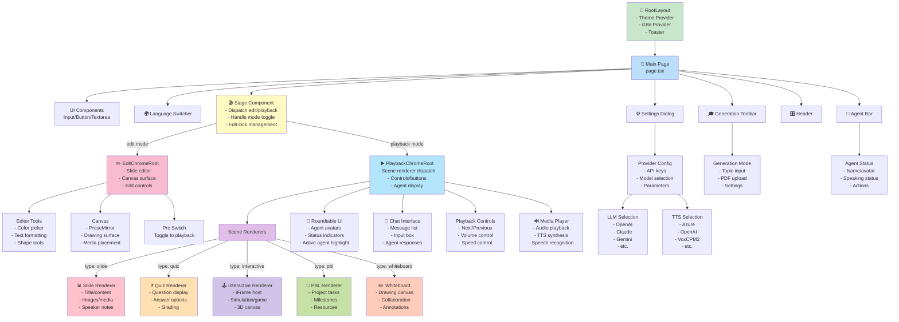
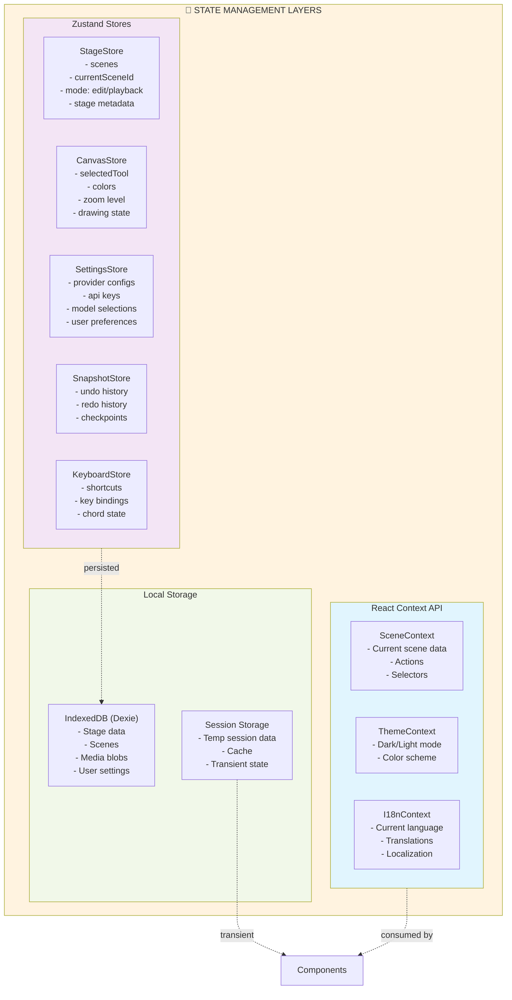
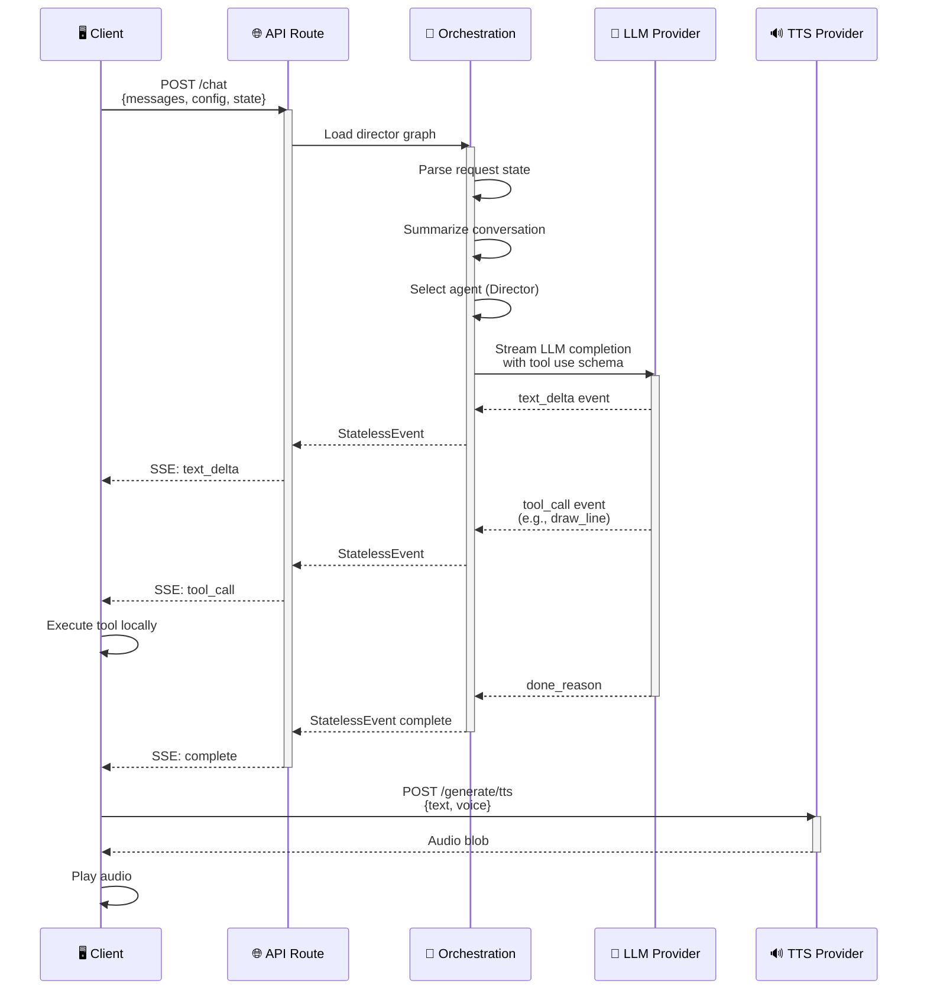
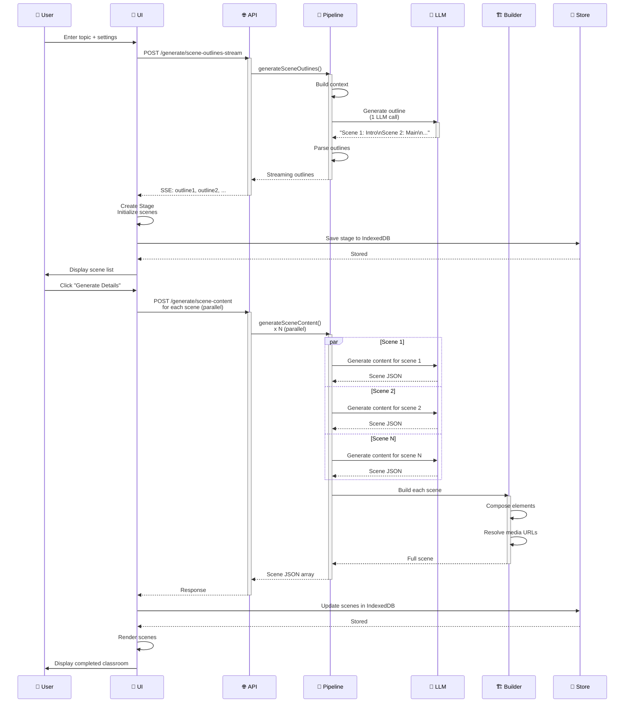
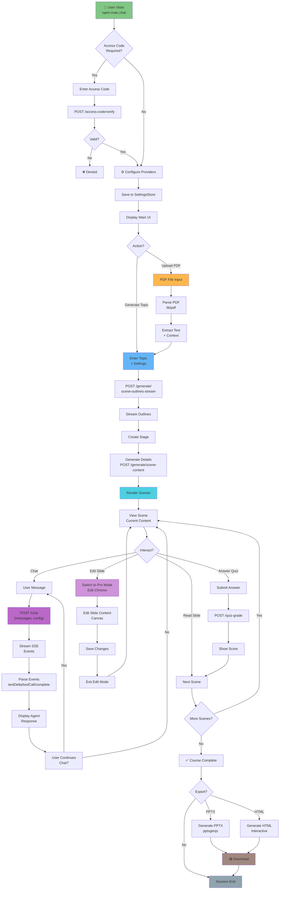
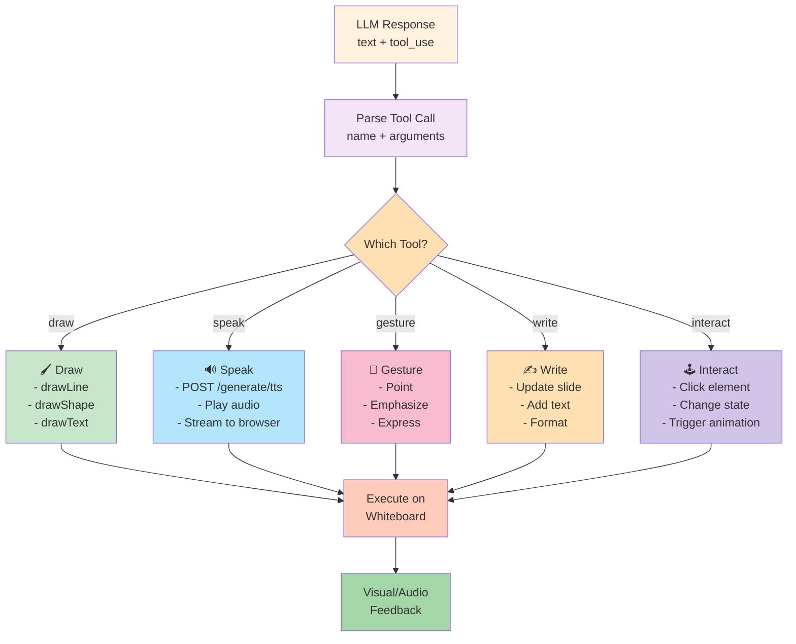
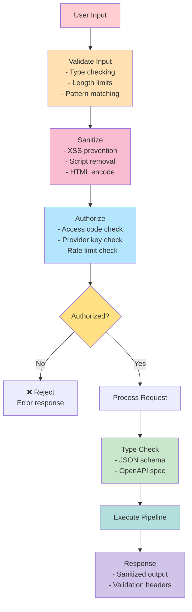

# OpenMAIC - Detailed Component Reference & Interactions

## 📐 Complete Component Hierarchy



## 🔄 State Flow Diagram



## 📊 API Request/Response Flow



## 🎬 Scene Generation Flow



## 🎯 User Interaction Flow



## 🔧 Tool Execution Pipeline



## 📱 Component Prop Interfaces

### Stage Component
```typescript
interface StageProps {
  onRetryOutline?: (outlineId: string) => Promise<void>;
}

// Internal state from useStageStore
{
  mode: 'edit' | 'playback' | 'autonomous';
  scenes: Scene[];
  currentSceneId: string;
  generatingOutlines: string[];
  stage?: StageData;
  setMode: (mode: string) => void;
}
```

### PlaybackChromeRoot Component
```typescript
interface PlaybackChromeRootHandle {
  teardown: () => Promise<void>;
}

// State managed internally
{
  activeSceneId: string;
  activeAgentId: string | null;
  chatMessages: UIMessage[];
  isGenerating: boolean;
  roundtableOpen: boolean;
}
```

### SceneRenderer Components
```typescript
interface SceneRendererProps {
  scene: Scene;
  onSceneChange?: (scene: Scene) => void;
  onNextScene?: () => void;
  isEditable?: boolean;
}

// Scene type discriminated union
type Scene = 
  | SlideScene & { type: 'slide' }
  | QuizScene & { type: 'quiz' }
  | InteractiveScene & { type: 'interactive' }
  | PBLScene & { type: 'pbl' }
  | WhiteboardScene & { type: 'whiteboard' };
```

## 🔐 Security & Validation



---

## 📚 Key Type Definitions

```typescript
// User Requirements for Generation
interface UserRequirements {
  topic?: string;
  document?: PdfContent;
  mode: 'generation' | 'discussion';
  sceneCount: number;
  agents: AgentConfig[];
  language: string;
  preferences?: {
    difficulty: 'beginner' | 'intermediate' | 'advanced';
    format: ('slide' | 'quiz' | 'interactive' | 'pbl')[];
  };
}

// Scene Blueprint
interface SceneOutline {
  id: string;
  index: number;
  type: 'slide' | 'quiz' | 'interactive' | 'pbl' | 'whiteboard';
  title: string;
  topics: string[];
  learningObjectives: string[];
  estimatedDuration: number;
}

// Full Scene Data
interface Scene {
  id: string;
  index: number;
  type: string;
  title: string;
  content: SceneContent;
  media: MediaElement[];
  actions: Action[];
  agents: AgentInfo[];
  metadata: Record<string, any>;
}

// Chat Message
interface UIMessage {
  id: string;
  role: 'user' | 'assistant' | 'agent';
  agentId?: string;
  content: string;
  timestamp: number;
  actions?: Action[];
}

// Agent Info
interface AgentInfo {
  id: string;
  name: string;
  role: 'teacher' | 'peer' | 'narrator';
  persona: string;
  avatar?: string;
  voice?: VoiceConfig;
  capabilities: string[];
}

// Action (Behavior Instruction)
interface Action {
  id: string;
  type: 'speak' | 'draw' | 'gesture' | 'interact' | 'write';
  target?: string;
  params: Record<string, any>;
  duration?: number;
}

// Streaming Event
type StatelessEvent = 
  | { type: 'textDelta'; index: number; delta: string }
  | { type: 'toolCall'; name: string; args: Record<string, any> }
  | { type: 'complete'; turnCount: number }
  | { type: 'error'; error: string };
```

---

This document provides a complete reference for understanding and navigating the OpenMAIC architecture at the component level, with detailed flows showing how data moves through the system and how users interact with various features.
